<p align="center">
  
</p>

<h3 align="center">Adversarial imperfect-information games in JAX.</h3>

<p align="center">
  Poker, bluffing and social deduction, compiled end to end with XLA.<br/>
  <code>jit</code> it, <code>vmap</code> it over thousands of tables, and collect hundreds of millions of samples per second.
</p>

<p align="center">
  <a href="https://aryamanreddi99.github.io/bluffjax/"></a>
  <a href="https://arxiv.org/abs/2610.07686"></a>
  
  
</p>

BluffJAX is a suite of ten adversarial imperfect-information games for reinforcement learning research, written in pure JAX so the whole game runs on your accelerator. It has the well-studied benchmarks (Kuhn, Leduc and Texas Hold'em) and five games that have never been studied in RL before: **Bluff**, **Kemps**, multi-round **Werewolf**, **5-Card Draw** and **7-Card Stud**. Baselines are included as well: CFR, Deep CFR, PPO, PQN, NFSP variants and ReBeL, plus pre-trained checkpoints.

## 🃏 Play it in your browser

**[aryamanreddi99.github.io/bluffjax](https://aryamanreddi99.github.io/bluffjax/)**: sit down at any of the ten tables and play against bots. There's nothing to install and no server. Each game's real BluffJAX `reset`, `step_env` and `get_avail_actions` are exported with `jax.export` to StableHLO and compiled to WebAssembly in your browser by [whlo](https://github.com/noahfarr/whlo), so the rules you play by are the exact rules your agents train on. (The bots are simple heuristics, not trained policies. That part is up to you.)

<table>
  <tr>
    <td width="50%"><a href="https://aryamanreddi99.github.io/bluffjax/">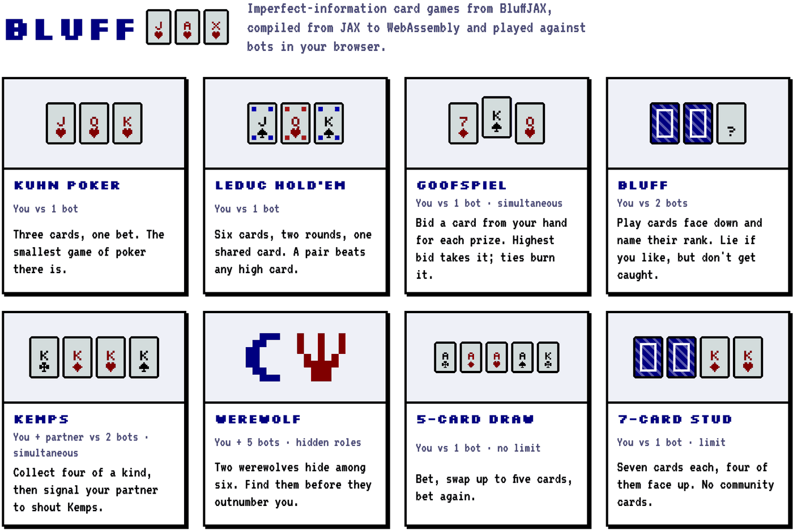</a></td>
    <td width="50%"><a href="https://aryamanreddi99.github.io/bluffjax/#bluff">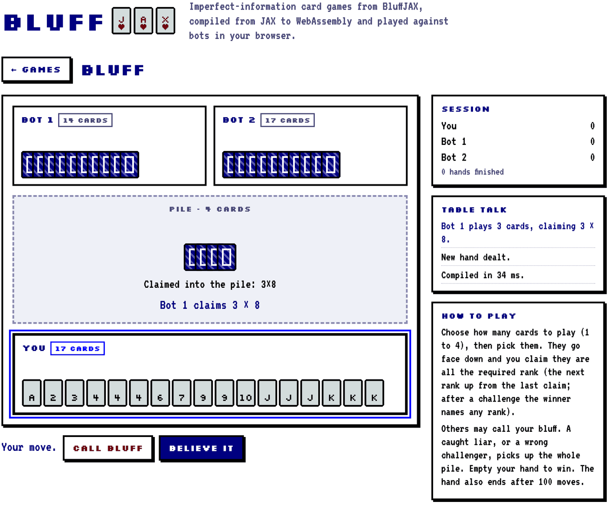</a></td>
  </tr>
  <tr>
    <td align="center"><em>Pick a table</em></td>
    <td align="center"><em>Bot 1 claims three 8s. Call bluff?</em></td>
  </tr>
</table>

## ✨ Why BluffJAX?

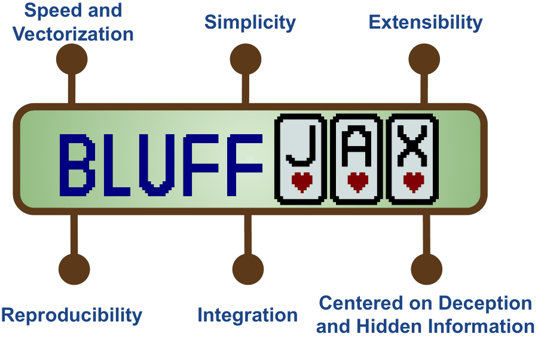

- **⚡ Fast.** Game logic is written for XLA, so it jit-compiles, vectorizes and stays on the GPU. One RTX 6000 Ada reaches about **2×10⁸ samples/s**, and four GPUs exceed **5×10⁸**.
- **🎭 Built around deception.** Lying about your cards, signalling a partner under the noses of your opponents, hiding a role. These are the mechanics where today's RL baselines still struggle.
- **🧩 Simple.** `make`, `reset`, `step`, `get_avail_actions`. Episode resets happen inside `step`, so a rollout is just a `lax.scan`.
- **🛠 Extensible.** Every game subclasses a generic `AECEnv` or `ParallelEnv`, so adding a new one means writing the rules, not the plumbing.
- **🔁 Reproducible.** Baseline algorithms and pre-trained checkpoints give you a fixed bar to measure against.

<br clear="right"/>

## 🎲 The games

Click a game to play it.

<table align="center">
<tr>
  <td align="center"><a href="https://aryamanreddi99.github.io/bluffjax/#kuhn_poker">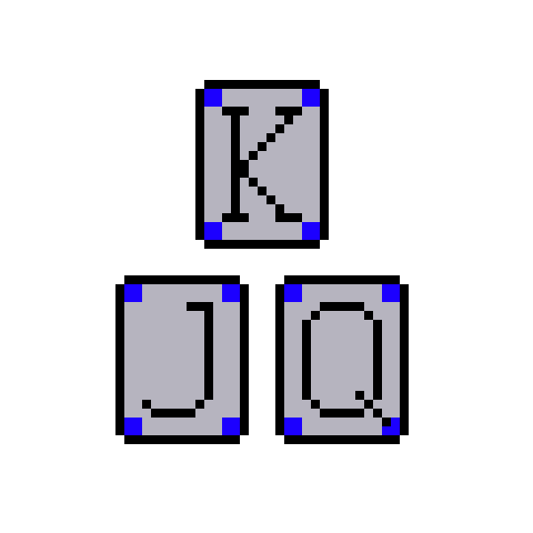</a><br/><sub><b>Kuhn Poker</b></sub></td>
  <td align="center"><a href="https://aryamanreddi99.github.io/bluffjax/#leduc_holdem">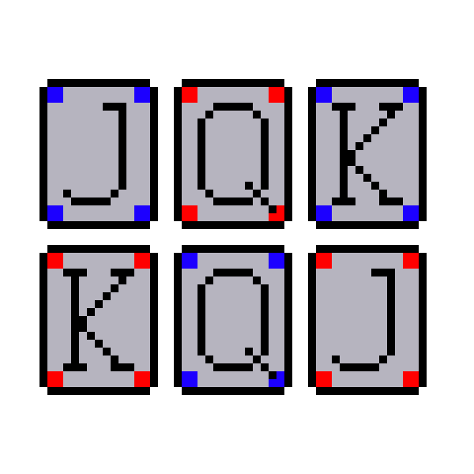</a><br/><sub><b>Leduc Hold'em</b></sub></td>
  <td align="center"><a href="https://aryamanreddi99.github.io/bluffjax/#texas_limit_holdem"></a><br/><sub><b>Texas Limit Hold'em</b></sub></td>
  <td align="center"><a href="https://aryamanreddi99.github.io/bluffjax/#texas_nolimit_holdem"></a><br/><sub><b>Texas No-Limit Hold'em</b></sub></td>
  <td align="center"><a href="https://aryamanreddi99.github.io/bluffjax/#five_card_draw">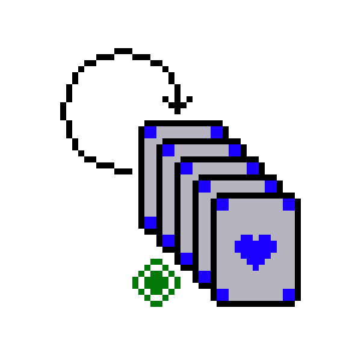</a><br/><sub><b>5-Card Draw</b></sub></td>
</tr>
<tr>
  <td align="center"><a href="https://aryamanreddi99.github.io/bluffjax/#seven_card_stud">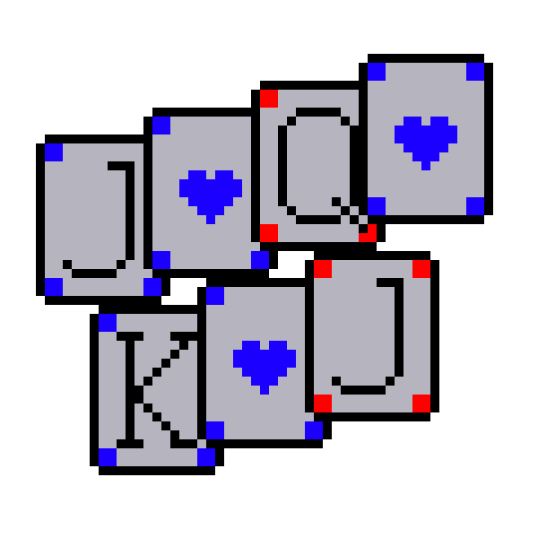</a><br/><sub><b>7-Card Stud</b></sub></td>
  <td align="center"><a href="https://aryamanreddi99.github.io/bluffjax/#goofspiel">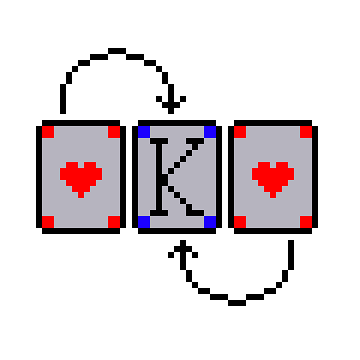</a><br/><sub><b>Goofspiel</b></sub></td>
  <td align="center"><a href="https://aryamanreddi99.github.io/bluffjax/#werewolf"></a><br/><sub><b>Werewolf</b></sub></td>
  <td align="center"><a href="https://aryamanreddi99.github.io/bluffjax/#bluff"></a><br/><sub><b>Bluff</b></sub></td>
  <td align="center"><a href="https://aryamanreddi99.github.io/bluffjax/#kemps">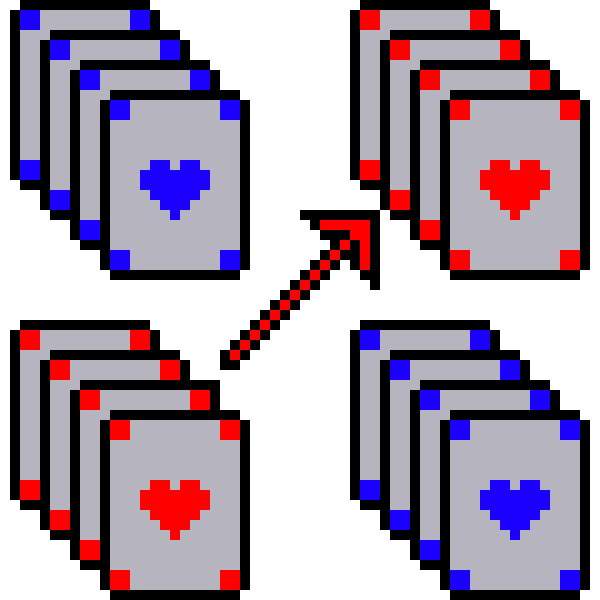</a><br/><sub><b>Kemps</b></sub></td>
</tr>
</table>

| Game | ID | Players (n) | Obs. size | Actions | API | Metric |
|---|---|:-:|:-:|:-:|:-:|---|
| Kuhn Poker | `kuhn_poker` | 2 | 9 | 2 | AEC | exploitability |
| Leduc Hold'em | `leduc_holdem` | 2 | 24 | 3 | AEC | exploitability |
| Texas Limit Hold'em | `texas_limit_holdem` | 2–10 | 72+n | 4 | AEC | chips/hand |
| Texas No-Limit Hold'em | `texas_nolimit_holdem` | 2–10 | 54 | 5 | AEC | chips/hand |
| 5-Card Draw 🆕 | `five_card_draw` | 2–10 | 54 | 37 | AEC | chips/hand |
| 7-Card Stud 🆕 | `seven_card_stud` | 2–10 | 77+208(n−1)+n | 4 | AEC | chips/hand |
| Goofspiel | `goofspiel` | 2 | 39 | 13 | Parallel | win rate |
| Bluff 🆕 | `bluff` | ≥3 | 263 | 13 | AEC | win rate |
| Werewolf 🆕 | `werewolf` | 6 | 43 | 7 | AEC | win rate |
| Kemps 🆕 | `kemps` | 4, 6, 8, … | 52(n+1)+n·c | 172·c | Parallel | win rate |

<sub>🆕 not previously studied in RL. Sizes are for the default settings; <i>c</i> is the size of Kemps' communication channel (default 2).</sub>

The new games each test something different:

- **5-Card Draw**: players swap cards with the house between betting rounds, so the deception moves from bet sizes to the draw.
- **7-Card Stud**: hands are revealed card by card across several betting rounds, giving long horizons and dense public information.
- **Bluff** (a.k.a. Cheat, I Doubt It): race to empty your hand by playing cards face down. You may lie about them, but you must avoid getting caught over a long episode.
- **Werewolf**: the first JAX implementation of multi-round Werewolf with multiple roles (werewolves, seer, doctor, villagers).
- **Kemps**: teams of two try to collect four of a kind, then must signal their partner publicly without the opposing team noticing.

**AEC vs. parallel.** In turn-based (AEC) games, `obs` and `action` belong to the player to move. In simultaneous-move (parallel) games, both have a leading `num_agents` axis. In both cases `reward` is a vector with one entry per agent.

## 🚀 Quick start

BluffJAX uses [uv](https://docs.astral.sh/uv/). It installs Python 3.12 and the exact dependency versions from `uv.lock` into `.venv`:

```bash
git clone https://github.com/AryamanReddi99/bluffjax.git
cd bluffjax
uv sync                  # CPU / Apple silicon
uv sync --extra cuda     # or this, on Linux with an NVIDIA GPU
```

This is the example from the paper: 1,000 agent actions in 16 parallel environments, as a single jit-compiled function. Save it as `example.py` and run `uv run python example.py`.

```python
import jax
import jax.numpy as jnp
import bluffjax

env = bluffjax.make("kuhn_poker")  # Create an environment
rng = jax.random.key(seed=42)
rng, rng_reset = jax.random.split(rng)
rng_resets = jax.random.split(rng_reset, 16)  # 16 parallel environments
state, obs = jax.vmap(env.reset)(rng_resets)

def get_action(rng, obs, avail):
    # Your agent goes here. This one plays a uniformly random legal action.
    return jax.random.categorical(rng, jnp.where(avail, 0.0, -1e9))

def step(carry, unused):
    rng, state, obs = carry
    rng, rng_act, rng_step = jax.random.split(rng, 3)
    avail = jax.vmap(env.get_avail_actions)(state)
    action = jax.vmap(get_action)(jax.random.split(rng_act, 16), obs, avail)
    state, obs, rew, absorbing, done, info = jax.vmap(env.step)(
        jax.random.split(rng_step, 16), state, action
    )
    return (rng, state, obs), rew

def step_scan(rng, state, obs):
    return jax.lax.scan(step, (rng, state, obs), None, length=1000)

(_, final_state, final_obs), rew = jax.jit(step_scan)(rng, state, obs)
```

The same code runs unchanged for all ten games. Swap the ID and go:

- `env.reset(rng)` returns `(state, obs)`. `state` holds everything about the game: private hands, public cards, whose turn it is.
- `env.step(rng, state, action)` returns `(state, obs, reward, absorbing, done, info)`. When `done` is true, the returned state is already a fresh episode.
- `absorbing` marks each agent that has reached an absorbing state (some players drop out early). `done` is set when all agents have, or when the horizon is reached.
- `env.get_avail_actions(state)` returns the legal-action mask.

Games take keyword arguments to change the table size and difficulty:

```python
print(bluffjax.available_envs())
env = bluffjax.make("bluff", num_agents=4, num_decks=2)                 # bigger table, double deck
env = bluffjax.make("texas_nolimit_holdem", num_agents=6, init_chips=200)
env = bluffjax.make("kemps", num_agents=6, comm_dim=4)                  # three teams, wider signal channel
```

## ⚡ Speed

Throughput grows log-linearly with the number of parallel environments. At 10,000 environments every game produces at least 10⁷ samples/s on a single GPU, and the lightest exceed 10⁸.

<p align="center">
  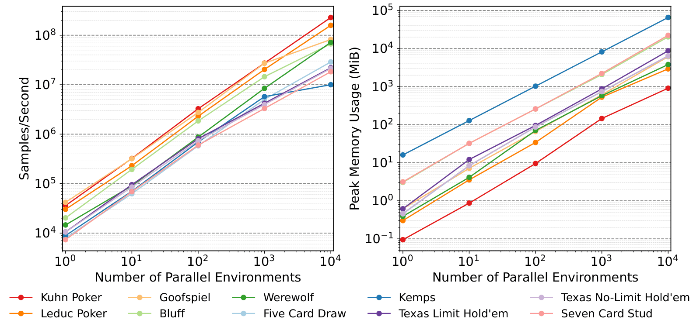
  <br/><sub>1000 random steps on an RTX 6000 Ada, mean of 10 seeds.</sub>
</p>

On the games other libraries share with BluffJAX, it matches or beats PGX, the GPU-based library. It is at least **10× faster than the CPU libraries** (OpenSpiel, RLCard, PettingZoo) from 1,000 environments up, and it is faster even with no parallelism at all.

<p align="center">
  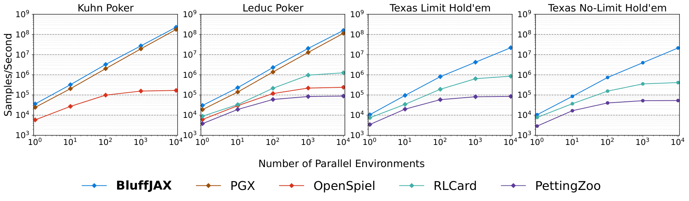
  <br/><sub>GPU: one RTX 6000 Ada. CPU: 16-core AMD Ryzen 9 with Python multiprocessing.</sub>
</p>

<details>
<summary><b>Scaling to multiple GPUs</b></summary>
<br/>
<p align="center">
  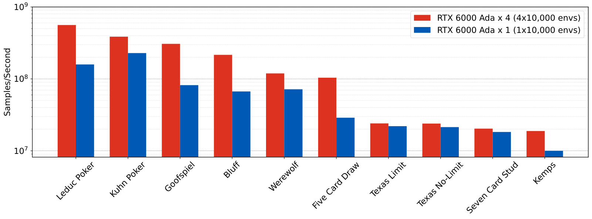
  <br/><sub>Four GPUs give 2.3× the throughput on average (10,000 environments per GPU).</sub>
</p>
</details>

## 📈 Baselines

Training scripts live in [`bluffjax/examples/`](bluffjax/examples):

| | CFR | Deep CFR | PPO | PQN | PPO-NFSP | PQN-NFSP | ReBeL |
|---|:-:|:-:|:-:|:-:|:-:|:-:|:-:|
| Kuhn Poker | ✅ | ✅ | ✅ | ✅ | ✅ | ✅ | ✅ |
| Leduc Hold'em | ✅ | ✅ | ✅ | ✅ | ✅ | ✅ | |
| Heads-up Limit / No-Limit Hold'em | | | | | ✅ | ✅ | ✅ |
| 5-Card Draw, 7-Card Stud, Werewolf, Bluff | | | | | ✅ | ✅ | |

```bash
uv run --extra baselines python bluffjax/examples/kuhn/kuhn_cfr.py                    # tabular CFR
uv run --extra baselines python bluffjax/examples/kuhn/kuhn_ppo_nfsp.py wandb=False   # PPO-NFSP in self-play
```

`--extra baselines` adds the training dependencies: `distrax`, `optax`, `chex`, `hydra-core` and `wandb`. Each training script reads its `config_*.yaml` through Hydra, so you can override any key on the command line. Wherever you launch from, scripts that save checkpoints write them to `checkpoints/<game>/`, and Hydra writes its config and log to `outputs/`, both at the repo root and gitignored. Pre-trained PPO-NFSP and PQN-NFSP checkpoints for 5-Card Draw, 7-Card Stud, Werewolf and Bluff are in `bluffjax/examples/<game>/checkpoints/`.

On the solved games, exploitability is measured exactly. The uniform random policy scores 0.4583 on Kuhn and 2.3736 on Leduc, matching OpenSpiel.

<table>
  <tr>
    <td width="50%">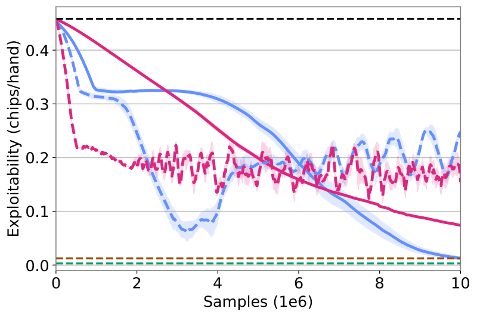</td>
    <td width="50%">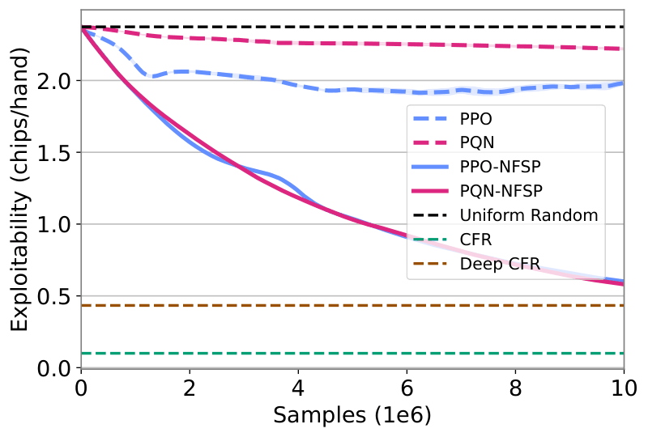</td>
  </tr>
  <tr>
    <td align="center"><sub>Kuhn Poker</sub></td>
    <td align="center"><sub>Leduc Hold'em (legend applies to both)</sub></td>
  </tr>
</table>

<details>
<summary><b>Heads-up Texas Hold'em against a ReBeL opponent</b></summary>
<br/>
<table>
  <tr>
    <td width="50%">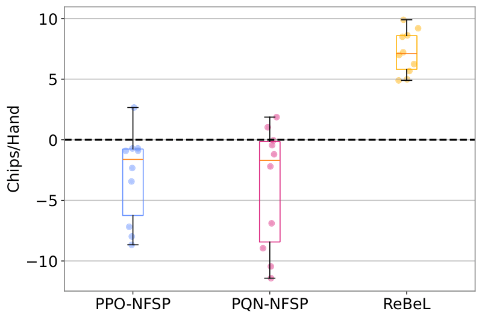</td>
    <td width="50%">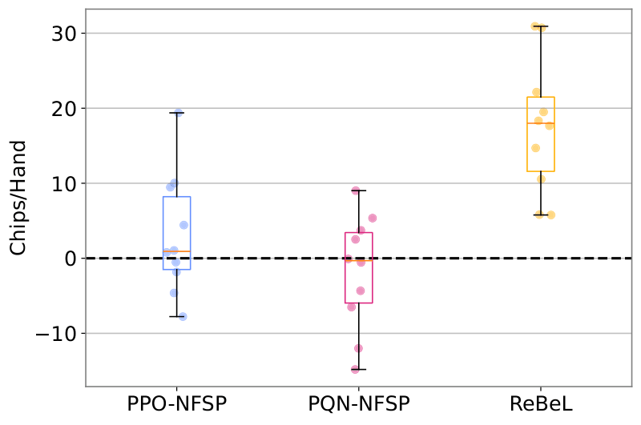</td>
  </tr>
  <tr>
    <td align="center"><sub>Limit</sub></td>
    <td align="center"><sub>No-Limit</sub></td>
  </tr>
</table>
<sub>Chips per hand against a ReBeL opponent trained for 5×10⁶ samples. Each algorithm trains in self-play for 10⁷ samples; 10 seeds; dashed line = break-even.</sub>
</details>

## 📝 Citation

```bibtex
@article{reddi2026bluffjax,
  title   = {BluffJAX: Adversarial Imperfect Information Games in JAX},
  author  = {Reddi, Aryaman and Peters, Jan and D'Eramo, Carlo},
  journal = {arXiv preprint arXiv:2610.07686},
  year    = {2026}
}
```
